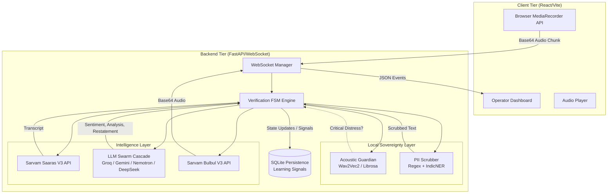

# Architecture: Samvaad 1092

The Samvaad 1092 platform is built on a **Sovereign Hybrid Architecture**. This design paradigm ensures maximum security and data privacy (Sovereign) while leveraging state-of-the-art Large Language Models for advanced reasoning (Hybrid).

## High-Level System Architecture

## Core Architectural Components

### 1. The Verification FSM (Finite State Machine)
The central nervous system of Samvaad 1092. It enforces a strict, linear pipeline:
`INIT` → `LISTEN` → `SCRUB` → `ANALYZE` → `RESTATE` → `WAIT_FOR_CONFIRM` → `VERIFIED`

At any point, if confidence drops or acoustic distress spikes, the FSM instantly breaks to the `HUMAN_TAKEOVER` state.

### 2. Local Sovereignty Layer
Before any data touches a third-party LLM, it must pass through:
- **Acoustic Guardian**: Runs entirely on the backend server. Analyzes audio frequencies (pitch, energy, speaking rate) to detect distress without transcribing.
- **PII Scrubber**: Uses local Regex and NER (Named Entity Recognition) to redact sensitive citizen data (Aadhaar, phone numbers, names).

### 3. LLM Swarm Cascade
A fault-tolerant routing engine that guarantees uptime and speed. Instead of relying on a single provider, the system cascades through:
1. **Groq (Llama 3 8B)**: Used for ultra-fast (sub-200ms) sentiment analysis.
2. **OpenRouter (Nemotron 120B / DeepSeek)**: Heavy-duty reasoning for emergency classification and cultural context.
3. **Gemini 1.5 Flash**: Fast multimodal fallback.

### 4. Persistence & Learning Signals
An asynchronous SQLite database (`aiosqlite`) captures the full lifecycle of a call. Crucially, when human operators manually edit an AI's analysis via the Dashboard, these corrections are saved as "Learning Signals" to improve future model fine-tuning.
