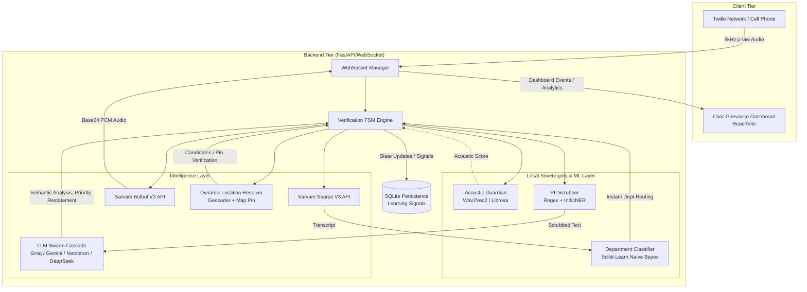

# Architecture: Samvaad 1092

The Samvaad 1092 platform is built on a **Sovereign Hybrid Architecture**. This design paradigm ensures maximum security and data privacy (Sovereign) while leveraging state-of-the-art Large Language Models for advanced reasoning (Hybrid), designed specifically for civic grievance management.

## High-Level System Architecture

## Core Architectural Components

### 1. The Verification FSM (Finite State Machine)
The central nervous system of Samvaad 1092. It enforces a strict, linear pipeline:
`INIT` → `LISTEN` → `SCRUB` → `ANALYZE` → `RESTATE` → `WAIT_FOR_CONFIRM` → `VERIFIED`

At any point, if confidence drops, the FSM instantly breaks to the `HUMAN_TAKEOVER` state.

### 2. Local Sovereignty & ML Layer
Before any data touches a heavy third-party LLM, it must pass through:
- **Acoustic Guardian**: Runs entirely on the backend server. Analyzes audio frequencies to detect distress, passing an acoustic score to the LLM to prevent false positives from bad phone mics.
- **Fast ML Department Routing**: A localized Scikit-Learn Naive Bayes model instantly classifies the civic complaint (e.g. BESCOM, BWSSB) in milliseconds. See [ML Models](ml_models.md) for details on the Active Learning integration.
- **PII Scrubber**: Uses local Regex and NER (Named Entity Recognition) to redact sensitive citizen data (Aadhaar, phone numbers, names).

### 3. LLM Swarm Cascade
A fault-tolerant routing engine that guarantees uptime and speed. Instead of relying on a single provider, the system cascades through:
1. **Groq (Llama 3)**: Used for ultra-fast sentiment analysis.
2. **OpenRouter / DeepSeek**: Heavy-duty reasoning for civic classification, severity, and cultural context.
3. **Gemini**: Fast multimodal fallback.

### 4. Civic Analytics & Persistence
An asynchronous SQLite database (`aiosqlite`) captures the full lifecycle of a call. Crucially, when human operators manually edit an AI's analysis via the Dashboard, these corrections are saved as "Learning Signals" to improve future model fine-tuning. The Dashboard pulls real-time analytics from this DB to display department loads and resolution rates.

## Current Live Demo Architecture Update

The live path now includes a deterministic call-center intake layer on top of the FSM. The assistant acknowledges the grievance, asks one question at a time, and verifies only after the required ticket fields are ready: issue, department, and usable location. Optional operational fields are stored when available: time, frequency, caller attempts, authority contact, and previous complaint ID.

Persistence has been expanded beyond a single transcript. Each call record stores raw transcript, scrubbed transcript, caller/assistant turn log, structured conversation memory, agent corrections, and active-learning feedback type.

Twilio turn-taking is explicit. VAD decides utterance boundaries, Sarvam streaming/REST STT transcribes, and barge-in only cancels assistant playback when Twilio marks a real speech frame. During assistant speech, echo protection raises the VAD threshold so line noise does not cancel TTS.

Location resolution is now dynamic, not a hard-coded demo list. The FSM sends heard area/landmark text to a provider chain: live geocoder search first, browser/operator map pin when available, and local fallback only when the provider is disabled or unavailable. Ambiguous matches create a `location_confirm` slot so the caller or operator confirms the exact place before dispatch.
